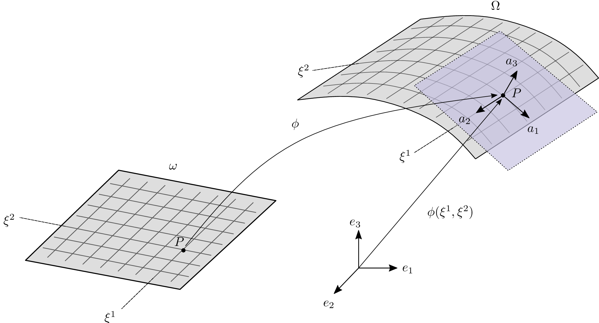

# Curvilinear elasticity

```@raw html

```

Curvilinear covariant basis vector (3D)
```math
\mathbf{g}_i=\frac{\partial \Phi(\xi^1,\xi^2,\xi^3)}{\partial \xi^i}, \quad i\in 1,2,3
```
where the latin indices run from 1 to 3. The **surface** covariant basis vector
```math
\mathbf{a}_\alpha=\frac{\partial \phi(\xi^1,\xi^2)}{\partial \xi^\alpha}, \quad \alpha\in 1,2
```
with greek indices running from 1 to 2. The first fundamental form or **metric tensor** of the surface and the curvilinear coordinate is then given
```math
a_{\alpha\beta} = \mathbf{a}_\alpha \cdot \mathbf{a}_\beta, \quad g_{\alpha\beta} = \mathbf{g}_\alpha \cdot \mathbf{g}_\beta
```
inverse of the **surface** first fundamental form
```math
a^{\alpha\beta} = [a_{\alpha\beta}]^{-1}
```
which allows to transform covariant quantities into their contravariant form
```math
\mathbf{a}^\alpha = a^{\alpha\beta}\mathbf{a}_\beta
```

The (unit) surface normal is then
```math
\hat{\mathbf{a}}_3 = \frac{\mathbf{a}_1 \times \mathbf{a}_2}{\|\mathbf{a}_1 \times \mathbf{a}_2\|}
```
which satisfies ``\mathbf{a}_3\cdot\mathbf{a}_\alpha=0``, and thus the second fundamental form of the surface is found
```math
b_{\alpha\beta} = \hat{\mathbf{a}}_3\cdot \mathbf{a}_{\alpha,\beta} = -\mathbf{a}_\alpha\cdot \hat{\mathbf{a}}_{3,\beta}
```

## 1. Green-Lagrange strain tensor

The Green-Lagrange strain tensor is given by half the increment in the metric tensor [chapelle2011](@citet)
```math
e_{ij} = \frac{1}{2}\left(g_{ij} - G_{ji}\right).
```
where ``g_{i,j}`` and ``G_{ij}`` are the metric tensor in the current and in the reference configuration, respectively.
Another form can be obtained by subsituting the definition of ``g_{ij}`` and ``G_{i,j}`` to get
```math
e_{ij} = \frac{1}{2}\left(\mathbf{g}_i\cdot\mathbf{g}_j - \mathbf{G}_j\cdot\mathbf{G}_i\right).
```
For linear analysis, it is common to expand the second expression with the definition of the covariant basis
```math
g_{ij} = \frac{\partial\Phi(\xi^1,\xi^2,\xi^3)}{\partial\xi^i}\cdot\frac{\partial\Phi(\xi^1,\xi^2,\xi^3)}{\partial\xi^j} \quad G_{ij} = \frac{\partial\Phi^0(\xi^1,\xi^2,\xi^3)}{\partial\xi^i}\cdot\frac{\partial\Phi^0(\xi^1,\xi^2,\xi^3)}{\partial\xi^j}
```
where the mapping in the current configuration can be through the displacement field
```math
\mathbf{u}(\xi^1,\xi^2,\xi^3) = \Phi(\xi^1,\xi^2,\xi^3) - \Phi^0(\xi^1,\xi^2,\xi^3)
```
dropping the ``(\xi^1,\xi^2,\xi^3)`` terms for brevity, we get
```math
e_{ij} = \frac{1}{2}\left(\left(\frac{\partial\Phi^0}{\partial\xi^i}+\frac{\partial\mathbf{u}}{\partial\xi^i}\right)\cdot\left(\frac{\partial\Phi^0}{\partial\xi^i}+\frac{\partial\mathbf{u}}{\partial\xi^i}\right) - \frac{\partial\Phi^0}{\partial\xi^i}\cdot\frac{\partial\Phi^0}{\partial\xi^j}\right)
```
expanding the first term and cancelling the last contribution with the first expansion, we get
```math
e_{ij} = \frac{1}{2}\left(\frac{\partial\Phi^0}{\partial\xi^i}\cdot\frac{\partial\mathbf{u}}{\partial\xi^j} + \frac{\partial\mathbf{u}}{\partial\xi^i}\cdot\frac{\partial\Phi^0}{\partial\xi^j} - \frac{\partial\mathbf{u}}{\partial\xi^i}\cdot\frac{\partial\mathbf{u}}{\partial\xi^j}\right)
```
or simply
```math
e_{ij} = \frac{1}{2}\left(\mathbf{G}_i\cdot\frac{\partial\mathbf{u}}{\partial\xi^j} + \frac{\partial\mathbf{u}}{\partial\xi^i}\cdot\mathbf{G}_j + \frac{\partial\mathbf{u}}{\partial\xi^i}\cdot\frac{\partial\mathbf{u}}{\partial\xi^j}\right).
```
In linear shell analysis the last term is usually dropped since it is quadratic in the displacement field and we arrive to the **linear** covariant shell strains
```math
e_{ij} = \frac{1}{2}\left(\mathbf{G}_i\cdot\mathbf{u}_{,j} + \mathbf{u}_{,i}\cdot\mathbf{G}_j\right).
```
In the following, we will use the full nonlinear covariant strain tensor.