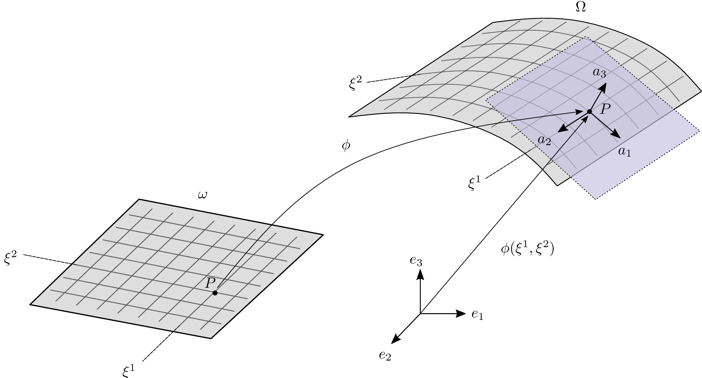

# Curvilinear elasticity
Most shells theories rely on the definition of a smooth injective immersion ``\Phi:\Omega\to\mathbf{E}^3``, which is a ``\mathcal{C}^1(\Omega,\mathbf{E}^3)`` difeomerophism, that maps from the curvilinear coordinate system defined on the open set ``\Omega\in\mathbb{R}^3`` onto the Euclidean space ``\mathbf{E}^3``. This immersion is fully characterized by the metric tensor ``g_{ij}=\mathbf{g}_i\cdot\mathbf{g}_j``, where the covariant basis vector are defined as
```math
\mathbf{g}_i=\frac{\partial \Phi(\xi^1,\xi^2,\xi^3)}{\partial \xi^i}, \quad i\in 1,2,3.
```
For an immersed 2D shell, where the curvilinear coordinates are obtained from an open set ``\omega\in\mathbb{R}^2``, see Figure 1. The immersion is fully characterized by two sets of equations, the **surface** metric tensor and the **curvature** tensor, both of which play an important role in shell theories.
```@raw html

```
The surface metric tensor ``a_{\alpha\beta}=\mathbf{a}_\alpha\cdot\mathbf{a}_\beta`` and the curvature tensor ``b_{\alpha\beta}=\hat{\mathbf{a}}_3\cdot\partial_\alpha\mathbf{a}_\beta`` are derive from the **surface** basis vectors
```math
\mathbf{a}_\alpha=\frac{\partial \phi(\xi^1,\xi^2)}{\partial \xi^\alpha}, \quad \alpha\in 1,2,
```
where the (unit) surface normal is given by
```math
\hat{\mathbf{a}}_3 = \frac{\mathbf{a}_1 \times \mathbf{a}_2}{\|\mathbf{a}_1 \times \mathbf{a}_2\|},
```
which obviously satisfies ``\hat{\mathbf{a}}_3\cdot\mathbf{a}_\alpha=0``. This allows to transform the second fundamental form of the surface
```math
\begin{split}
\partial_\beta(\hat{\mathbf{a}}_3\cdot\mathbf{a}_\alpha) &= \hat{\mathbf{a}}_3\cdot \partial_\beta\mathbf{a}_{\alpha} + \partial_\beta\hat{\mathbf{a}}_{3}\cdot\mathbf{a}_\alpha = 0,\\
-\mathbf{a}_\alpha\cdot \partial_\beta\hat{\mathbf{a}}_{3} &= \hat{\mathbf{a}}_3\cdot \partial_\beta\mathbf{a}_{\alpha} = b_{\alpha\beta}.\\
\end{split}
```
The first fundamental form or **metric tensor** of the surface has an inverse
```math
a^{\alpha\beta} = [a_{\alpha\beta}]^{-1}
```
which allows to transform covariant quantities into their contravariant form
```math
\mathbf{a}^\alpha = a^{\alpha\beta}\mathbf{a}_\beta.
```

!!! note
    In the following, we use the notation ``\mathbf{a}_{\alpha,\beta}`` and ``\partial_\beta\mathbf{a}_\alpha`` for ``\frac{\partial\mathbf{a}_\alpha}{\partial\xi^\beta}``.

## Green-Lagrange strain tensor

The Green-Lagrange strain tensor is given by half the increment in the metric tensor [chapelle2011](@citet)
```math
e_{ij} = \frac{1}{2}\left(g_{ij} - G_{ij}\right).
```
where ``g_{i,j}`` and ``G_{ij}`` are the metric tensor in the current and in the reference configuration, respectively.
Another form can be obtained by subsituting the definition of ``g_{ij}`` and ``G_{i,j}`` to get
```math
e_{ij} = \frac{1}{2}\left(\mathbf{g}_i\cdot\mathbf{g}_j - \mathbf{G}_j\cdot\mathbf{G}_i\right).
```
For linear analysis, it is common to expand the second expression with the definition of the covariant basis
```math
g_{ij} = \frac{\partial\Phi(\xi^1,\xi^2,\xi^3)}{\partial\xi^i}\cdot\frac{\partial\Phi(\xi^1,\xi^2,\xi^3)}{\partial\xi^j} \quad G_{ij} = \frac{\partial\Phi^0(\xi^1,\xi^2,\xi^3)}{\partial\xi^i}\cdot\frac{\partial\Phi^0(\xi^1,\xi^2,\xi^3)}{\partial\xi^j}
```
where we can substitute the displacement field for the mapping in the current configuration
```math
\mathbf{u}(\xi^1,\xi^2,\xi^3) = \Phi(\xi^1,\xi^2,\xi^3) - \Phi^0(\xi^1,\xi^2,\xi^3)
```
dropping the ``(\xi^1,\xi^2,\xi^3)`` terms for brevity, we get
```math
e_{ij} = \frac{1}{2}\left(\left(\frac{\partial\Phi^0}{\partial\xi^i}+\frac{\partial\mathbf{u}}{\partial\xi^i}\right)\cdot\left(\frac{\partial\Phi^0}{\partial\xi^j}+\frac{\partial\mathbf{u}}{\partial\xi^j}\right) - \frac{\partial\Phi^0}{\partial\xi^i}\cdot\frac{\partial\Phi^0}{\partial\xi^j}\right)
```
expanding the first term and cancelling the last contribution with the first expansion, we get
```math
e_{ij} = \frac{1}{2}\left(\frac{\partial\Phi^0}{\partial\xi^i}\cdot\frac{\partial\mathbf{u}}{\partial\xi^j} + \frac{\partial\mathbf{u}}{\partial\xi^i}\cdot\frac{\partial\Phi^0}{\partial\xi^j} - \frac{\partial\mathbf{u}}{\partial\xi^i}\cdot\frac{\partial\mathbf{u}}{\partial\xi^j}\right)
```
or simply
```math
e_{ij} = \frac{1}{2}\left(\mathbf{G}_i\cdot\frac{\partial\mathbf{u}}{\partial\xi^j} + \frac{\partial\mathbf{u}}{\partial\xi^i}\cdot\mathbf{G}_j + \frac{\partial\mathbf{u}}{\partial\xi^i}\cdot\frac{\partial\mathbf{u}}{\partial\xi^j}\right).
```
In linear shell analysis the last term is usually dropped since it is quadratic in the displacement field and we arrive to the **linear** covariant shell strains
```math
e_{ij} = \frac{1}{2}\left(\mathbf{G}_i\cdot\mathbf{u}_{,j} + \mathbf{u}_{,i}\cdot\mathbf{G}_j\right).
```
In the following, we will use the full nonlinear covariant strain tensor.